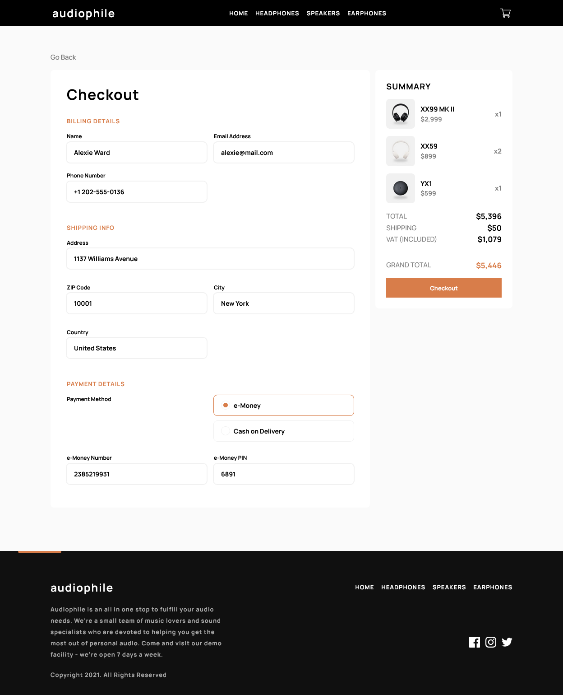
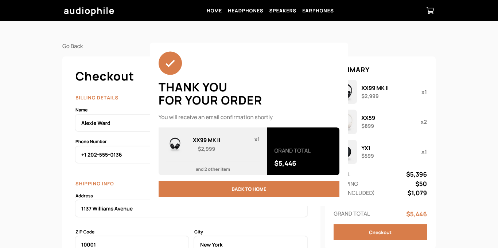
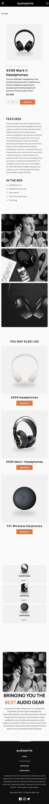
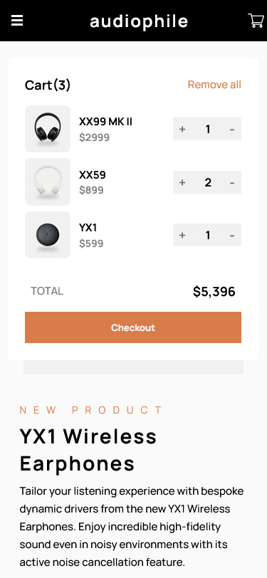
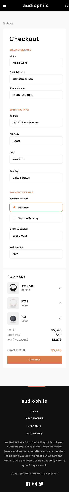
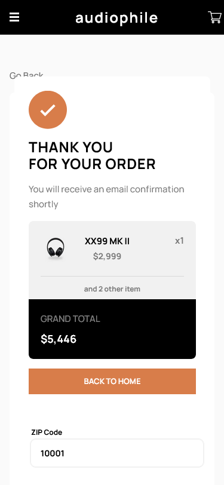

# Frontend Mentor - Audiophile e-commerce website solution

This is a solution to the [Audiophile e-commerce website challenge on Frontend Mentor](https://www.frontendmentor.io/challenges/audiophile-ecommerce-website-C8cuSd_wx). Frontend Mentor challenges help you improve your coding skills by building realistic projects.

## Table of contents

- [Overview](#overview)
  - [The challenge](#the-challenge)
  - [Screenshot](#screenshot)
  - [Links](#links)
- [My process](#my-process)
  - [Built with](#built-with)
  - [What I learned](#what-i-learned)
  - [Continued development](#continued-development)
  - [Useful resources](#useful-resources)
- [Author](#author)
- [Acknowledgments](#acknowledgments)

## Overview

### The challenge

Users should be able to:

- View the optimal layout for the app depending on their device's screen size
- See hover states for all interactive elements on the page
- Add/Remove products from the cart
- Edit product quantities in the cart
- Fill in all fields in the checkout
- Receive form validations if fields are missed or incorrect during checkout
- See correct checkout totals depending on the products in the cart
  - Shipping always adds $50 to the order
  - VAT is calculated as 20% of the product total, excluding shipping
- See an order confirmation modal after checking out with an order summary
- **Bonus**: Keep track of what's in the cart, even after refreshing the browser (`localStorage` could be used for this if you're not building out a full-stack app)

### Screenshots

### Links

- Solution URL: [Github Audiophile Ecommerce Website](https://github.com/abdul-haseeb123/audiophile-ecommerce-website)
- Live Site URL: [Audiophile Ecommerce](https://audiophile-ecommerce-website-sandy.vercel.app/)

## My process

### Built with

- Semantic HTML5 markup
- Flexbox
- CSS Grid
- Mobile-first workflow
- [React](https://reactjs.org/) - JS library
- [Next.js](https://nextjs.org/) - React framework
- [TypeScript](https://www.typescriptlang.org/) - For type checking
- [MongoDB Atlas](https://www.mongodb.com/atlas) - For database
- [Cloudinary](https://cloudinary.com/) - For image hosting
- [Mongoose](https://mongoosejs.com/) - For MongoDB object modeling
- [Tailwind CSS](https://tailwindcss.com/) - For styles
- [React Hook Form](https://react-hook-form.com/) - For form validation
- [Radix](https://radix-ui.com/) - For modal, and alerts
- [Next Cloudinary](https://next.cloudinary.dev/) - For image optimization

### Continued development

This can be improved by adding more features like:

- Payment gateway integration
- toast notifications
- email notifications for order confirmation

### Useful resources

- [Sam Selikoff Youtube](https://youtu.be/KvZoBV_1yYE?si=ZNkPK-etSASmrPpi) - This video helped me in creating custom dialogs and alerts using Radix UI.
- [React Hook Form](https://react-hook-form.com/) - This documentation helped me in form validation.
- [Next.js Cloudinary](https://next.cloudinary.dev/) - This documentation helped me in displaying and uploading images to cloudinary using next.js.

## Author

- Frontend Mentor - [@abdul-haseeb123](https://www.frontendmentor.io/profile/abdul-haseeb123)
- LinkedIn - [@ashaseeb](https://www.linkedin.com/in/ashaseeb/)
